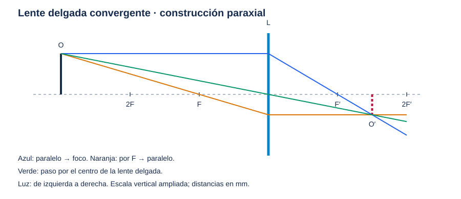
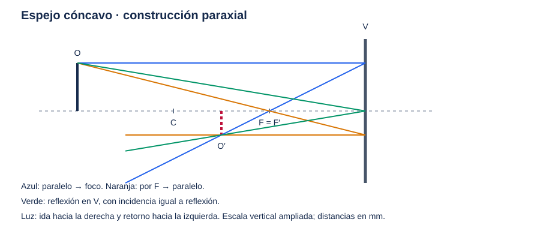

# Guía práctica de trazado manual de rayos

Para trabajar con papel cuadriculado, regla, lápiz y tres colores. Empezaremos por la aproximación paraxial: rayos próximos al eje y ángulos pequeños. Las construcciones con focos de una lente delgada o un espejo esférico pertenecen a esta aproximación; no describen exactamente todos los rayos de gran abertura.

Usaremos **O** para el objeto, **O′** para su imagen y **F/F′** para los focos objeto e imagen. En un sistema con varios elementos, F/F′ sin subíndice designan los focos del conjunto.

## 1. Preparar el dibujo y fijar los signos

1. Traza un eje óptico horizontal y escribe el sentido inicial de la luz: de izquierda a derecha.
2. Sitúa el elemento en x=0. En estos ejercicios el origen es el elemento, no la abertura inicial del simulador.
3. Elige una escala horizontal; por ejemplo, 1 cm de papel representa 25 mm. Puedes ampliar la escala vertical para ver mejor los rayos, pero entonces no midas ángulos directamente en el dibujo.
4. Marca las alturas positivas por encima del eje y las negativas por debajo.
5. Dibuja O como un segmento vertical continuo, sin flecha. Llama P a su extremo superior.
6. Dibuja en continuo los trayectos que recorre la luz. Usa discontinuo para prolongaciones auxiliares que no transportan luz. Representa O′ y su plano en discontinuo, siguiendo la convención gráfica del simulador: esto, por sí solo, **no significa que la imagen sea virtual**.

Para comprobar los ejercicios utilizaremos distancias de conjugado:

| Magnitud | Convenio de estos ejercicios |
|---|---|
| s | Positiva para un objeto real del que llega la luz |
| s′ | Positiva para una imagen real en el recorrido de salida; negativa para una virtual |
| f | Positiva para lente convergente o espejo cóncavo |
| h, h′ | Alturas firmadas; h′<0 significa imagen invertida |

No confundas estas distancias con coordenadas x. En una lente en x=0, `xO=−s` y `xO′=s′`. En un espejo en x=0 iluminado desde la izquierda, `xO=−s` y `xO′=−s′`: la luz reflejada sale hacia la izquierda.

## 2. Una lente delgada convergente, paso a paso

**Ejercicio:** focal f=50 mm, objeto a s=150 mm, altura h=10 mm. Supón abertura suficiente para los tres rayos.

### Paso 1: colocar lente, focos y objeto

Representa la lente mediante su plano vertical en x=0. Marca F en x=−50 mm y F′ en x=+50 mm. Marca también −100 y +100 mm como referencias de doble distancia focal. Coloca O en x=−150 mm y su extremo P en y=10 mm.

### Paso 2: rayo paralelo

Desde P, dibuja una horizontal hasta la lente. Después de la lente, une el punto de incidencia con F′ y continúa esa recta. El cambio de dirección se representa en el plano de la lente porque estamos usando una lente delgada equivalente.

### Paso 3: rayo central

Une P con el centro de la lente, (0,0), y prolonga la recta hacia la derecha. En la aproximación de lente delgada en aire, este rayo no cambia de dirección global.

### Paso 4: rayo por F

Une P con F y continúa hasta la lente. Desde ese punto de incidencia dibuja una horizontal hacia la derecha. En este ejemplo llega a la lente a y=−5 mm.

### Paso 5: encontrar P′ y dibujar O′

Los tres rayos salientes deben cruzarse en el mismo punto P′. Dos bastan para localizarlo; el tercero comprueba el dibujo. Desde P′ dibuja un segmento perpendicular al eje para representar O′. Obtendrás aproximadamente x=75 mm, h′=−5 mm.



### Paso 6: verificar con números

```text
1/s + 1/s′ = 1/f
1/s′ = 1/50 − 1/150 = 1/75
s′ = 75 mm
m = −s′/s = −0,5
h′ = m h = −5 mm
```

La imagen es **real, invertida y de la mitad de tamaño**. Puedes poner una pantalla en su plano para recogerla. Si tus líneas dan una imagen derecha, revisa el rayo saliente que debe pasar por F′.

### ¿Qué cambia al mover el objeto?

| Posición de objeto real | Resultado para lente convergente |
|---|---|
| s>2f | Imagen real, invertida, reducida, entre f y 2f |
| s=2f | Imagen real, invertida, del mismo tamaño, en 2f |
| f<s<2f | Imagen real, invertida, ampliada, más allá de 2f |
| s=f | Salida paralela; imagen en infinito |
| 0<s<f | Imagen virtual, derecha y ampliada |

**Prueba virtual:** cambia s a 25 mm manteniendo f=50 mm. Resulta s′=−50 mm y m=+2. Los rayos salientes divergen: prolonga hacia atrás sus rectas con trazos discontinuos. Esas prolongaciones se cruzan en x=−50 mm. No conviertas en discontinuo el trayecto que sí recorre la luz.

### Si la lente es divergente

En aire, f<0. El foco imagen F′ está a la izquierda y el foco objeto F a la derecha para incidencia desde la izquierda. El rayo paralelo sale divergiendo como si procediera de F′; el dirigido hacia F sale paralelo; el central conserva su dirección. Para un objeto real, sus prolongaciones dan una imagen virtual, derecha y reducida. Con f=−50 mm y s=150 mm: s′=−37,5 mm y m=+0,25.

Estas construcciones y la clasificación se corresponden con el capítulo B28 de Schnick aportado en `Full.pdf`; también puede consultarse [B28 en LibreTexts](https://phys.libretexts.org/Bookshelves/University_Physics/Calculus-Based_Physics_%28Schnick%29/Volume_B%3A_Electricity_Magnetism_and_Optics/B28%3A_Thin_Lenses_-_Ray_Tracing).

## 3. Un espejo cóncavo, paso a paso

**Ejercicio:** espejo mirando hacia la izquierda, vértice V en x=0, radio geométrico de magnitud 100 mm, objeto a s=150 mm y altura h=10 mm.

### Paso 1: colocar V, C y F

Sitúa el centro de curvatura C en x=−100 mm. El foco paraxial queda a mitad de camino: F en x=−50 mm. Para este espejo F y F′ coinciden físicamente. Su focal de conjugado es f=+50 mm; su radio **cartesiano** es R=−100 mm porque el centro queda a la izquierda. Son dos convenios diferentes, no signos contradictorios.

### Paso 2: rayo paralelo

Desde P, dibuja una horizontal hacia el espejo. Al reflejarse, el rayo vuelve hacia la izquierda pasando por F. No prolongues el rayo transmitido detrás del espejo: el espejo ideal refleja toda la luz incidente.

### Paso 3: rayo por F

Desde P traza una recta que pase por F y alcance el espejo. Su reflexión sale horizontal hacia la izquierda.

### Paso 4: comprobar con el rayo al vértice

Une P con V. La normal en V coincide con el eje. Dibuja el rayo reflejado hacia la izquierda con igual ángulo respecto de esa normal, por debajo del eje en este ejemplo. No se transmite a través de V.

Una alternativa es el rayo cuya recta pasa por C: incide normalmente en la esfera y vuelve por la misma recta, si lo admite la abertura.

### Paso 5: localizar la imagen

Busca el cruce de los rayos **reflejados**, no un cruce cualquiera entre un rayo de ida y otro de vuelta. Queda en x=−75 mm, y=−5 mm. Representa O′ desde el eje hasta ese punto.



El esquema concentra la reflexión paraxial en el plano del vértice. Si dibujas la superficie curva y buscas precisión geométrica, debes usar su intersección real y la normal local: las reglas focales ya no son exactas para rayos alejados del eje.

### Paso 6: verificar

```text
f = |R|/2 = 50 mm
s′ = f s/(s−f) = 50·150/100 = 75 mm
xO′ = −s′ = −75 mm
m = −s′/s = −0,5; h′ = −5 mm
```

La imagen es real e invertida, delante del espejo. Si pones el objeto a s=25 mm, resulta s′=−50 mm: imagen virtual en x=+50 mm, detrás del espejo, derecha y ampliada. Solo las prolongaciones discontinuas de los rayos reflejados llegan allí.

La relación focal y las reglas de reflexión corresponden al régimen paraxial de un espejo esférico. Véase [OpenStax: espejos esféricos](https://openstax.org/books/university-physics-volume-3/pages/2-2-spherical-mirrors).

## 4. Los dos modos nuevos del simulador

### Rayos paralelos desde infinito

Dibuja tres horizontales incidentes a alturas −h, 0 y +h; no necesitas situar un objeto a una distancia enorme. Tras una lente convergente pasan por F′. Tras un espejo cóncavo regresan hacia su foco. Con elementos divergentes, sus prolongaciones se cortan en el foco virtual.

Esto representa un punto axial en infinito. Un haz paralelo inclinado corresponde a otro punto del plano focal, no al foco axial.

### Rayos desde F

Para una lente convergente, parte del punto F sobre el eje y dibuja tres rayos hacia diferentes alturas de la lente. Después salen paralelos al eje. Para un espejo cóncavo, los rayos de F se reflejan en un haz paralelo de retorno.

Si F es virtual para el elemento, usa rayos incidentes dirigidos hacia F y prolongaciones auxiliares para mostrar esa dirección. Un sistema afocal no tiene un F finito desde el que hacer esta construcción.

La inversión del recorrido foco–haz paralelo expresa la reversibilidad óptica; [OpenStax: lentes delgadas](https://openstax.org/books/university-physics-volume-3/pages/2-4-thin-lenses) ilustra esta construcción. En el trazado exacto de superficies esféricas, no esperes paralelismo perfecto de todos los rayos de gran abertura.

## 5. Cómo pasar a sistemas más complejos

### A. Varias lentes delgadas: imagen intermedia

1. Calcula la imagen que formaría el primer elemento por sí solo.
2. Usa su posición como objeto del siguiente. Si ese punto queda después de la segunda lente, los rayos llegan convergiendo hacia él: es un objeto virtual para esa lente y s₂<0.
3. Continúa los mismos rayos hasta la segunda lente y vuelve a aplicar sus reglas. No obligues a cada rayo a pasar por el foco de cada lente: esa regla corresponde específicamente al rayo que llega paralelo.
4. Multiplica los aumentos: `m_total=m₁m₂…`.
5. Comprueba en cada elemento si el rayo cabe en su abertura. Si queda bloqueado, termina ahí.

**Ejemplo calculado:** primera lente en x=0, f₁=50 mm y objeto x=−150 mm. Su imagen intermedia está en x=75 mm. Segunda lente en x=100 mm con f₂=40 mm: s₂=25 mm, s₂′=−66,67 mm. La imagen final está en x=33,33 mm y es virtual respecto de la salida de la segunda lente. El aumento total es `(−0,5)(+2,667)=−1,333`.

La imagen intermedia no es una pantalla ni detiene la luz: los rayos siguen propagándose.

### B. Lentes gruesas: tabla superficie a superficie

Para hacer el cálculo paraxial a mano, lleva una tabla con superficie, posición, radio R, índices antes/después, altura y y ángulo reducido q=nu. El centro de curvatura a la derecha da R>0 durante el recorrido inicial hacia la derecha.

```text
Propagación una distancia d dentro de índice n:
    y_nueva = y + (d/n) q
    q_nuevo = q

Refracción en una superficie de radio R:
    q_nuevo = q − y (n₂−n₁)/R
    y_nueva = y
```

En una cara plana, R=∞: q permanece constante, pero el ángulo `u=q/n` cambia si cambia n. No interpretes q constante como ausencia de refracción.

**Ejemplo numérico reproducible:** superficie convexa R=26,25 mm, n=1,517, grosor 5 mm, segunda cara plana; rayo paralelo de altura 1 mm:

```text
Cara 1: q = −0,517/26,25 = −0,01969524
Cara 2: y = 1 + (5/1,517)q = 0,935085 mm
Salida al aire: q no cambia en la cara plana
Distancia hasta el eje: −y/q = 47,4777 mm ≈ 47,48 mm
```

La focal efectiva es 50,7737 mm; no coincide con esa distancia desde la cara posterior.

En una lente gruesa, los planos principales H/H′ sustituyen al único plano de una lente delgada equivalente. No supongas que un rayo que cruza cualquier “centro” geométrico conserva una única recta.

### C. Espejos dentro del sistema

Después de cada reflexión, escribe de nuevo el sentido real de propagación. Si la luz vuelve por una lente anterior, debe atravesar otra vez sus dos superficies, ahora en orden inverso. El foco del conjunto no se obtiene sumando las distancias focales de sus elementos.

Para matrices se puede desplegar el recorrido con una coordenada que crezca siguiendo la marcha de la luz, como hace el simulador. No mezcles esas matrices con radios cartesianos sin transformar ni añadas índices negativos sin cambiar todo el convenio. La equivalencia está desarrollada en [la verificación del proyecto](verification.md).

### D. Stop y pupilas

El stop es la abertura que limita el haz del punto axial para el conjugado elegido. Su imagen a través de la óptica anterior es la pupila de entrada; su imagen a través de la posterior es la de salida. No tienen por qué coincidir con una abertura física.

El rayo principal de campo (*chief ray*) pasa desde un punto fuera del eje por el centro del stop. Los marginales axiales van desde el punto axial del objeto hacia sus bordes. No son nombres alternativos de los tres rayos de construcción del ejercicio.

## 6. Construir tu propia tabla de trazado paraxial

Una tabla de trazado paraxial organiza los datos del sistema y los cálculos de los rayos marginal y principal. Aquí colocaremos las **superficies en columnas** e incluiremos curvatura, separación, índices, potencia, altura y ángulo reducido. Es una organización de uso general, no una plantilla exclusiva de un fabricante. Indicaremos explícitamente qué datos corresponden al espacio anterior y al posterior de cada superficie y resolveremos un ejemplo completo.

### Paso 1: numerar las columnas

Haz una columna para el plano inicial, una por **cada cara óptica**, otra por cada diafragma y una final para la imagen. Una lente gruesa requiere dos columnas. El plano objeto, el diafragma y el plano imagen no refractan: su potencia es cero.

Escribe encima el nombre de cada cara y su posición. Para una primera tabla, trabaja solo con lentes y propagación hacia la derecha; al final indicamos cómo incorporar espejos.

### Paso 2: copiar esta plantilla

Las filas con barra superior corresponden al rayo principal de campo; las otras, a un rayo axial de prueba que después convertirás en marginal.

| Fila | Plano inicial 0 | Superficie 1 | Superficie 2 | … | Imagen |
|---|---|---|---|---|---|
| Nombre de la cara/plano | | | | | |
| Posición x (mm) | | | | | |
| Radio R (mm) | ∞ | | | | ∞ |
| Curvatura c=1/R (mm⁻¹) | 0 | | | | 0 |
| Índice incidente n⁻ | | | | | |
| Índice saliente n⁺ | | | | | |
| Separación hasta la siguiente columna d (mm) | | | | | — |
| Distancia reducida d/n⁺ (mm) | | | | | — |
| Potencia Φ=(n⁺−n⁻)c (mm⁻¹) | 0 | | | | 0 |
| Menos potencia −Φ (mm⁻¹) | 0 | | | | 0 |
| Diámetro útil D (mm) | — | | | | — |
| Altura axial y (mm) | | | | | |
| Ángulo reducido incidente q⁻=n⁻u⁻ | | | | | |
| Ángulo reducido saliente q⁺=n⁺u⁺ | | | | | |
| Pendiente saliente u⁺=q⁺/n⁺ (rad, paraxial) | | | | | |
| Altura del principal ȳ (mm) | | | | | |
| Ángulo reducido principal q̄⁻ | | | | | |
| Ángulo reducido principal q̄⁺ | | | | | |
| Pendiente principal ū⁺=q̄⁺/n⁺ | | | | | |

Puedes omitir Φ y conservar solo −Φ, pero rotula claramente cuál utilizas. No confundas la curvatura c con el coeficiente C de una matriz ABCD. En las celdas ópticas, “∞” para el radio significa cara plana; “—” significa que esa celda no se aplica.

### Paso 3: rellenar primero los datos fijos

1. Pon los radios firmados: centro a la derecha, R positivo; centro a la izquierda, R negativo.
2. Calcula c=1/R; para una cara plana, c=0.
3. Anota n⁻ y n⁺ para la longitud de onda elegida. No escribas únicamente el índice del vidrio: al salir, el medio cambia otra vez a aire.
4. En la columna i coloca **dᵢ=xᵢ₊₁−xᵢ**, el espacio posterior a esa superficie. Divide por su índice saliente para obtener dᵢ/nᵢ⁺.
5. Calcula Φ y −Φ. Conserva al menos seis cifras durante las operaciones; redondea al presentar el resultado.

### Paso 4: elegir las condiciones iniciales

- **Objeto axial finito:** y₀=0; escoge un q₀ pequeño y distinto de cero. Es un rayo de prueba, todavía no necesariamente el marginal.
- **Objeto axial en infinito:** toma un plano inicial finito de referencia, y₀≠0 y q₀=0. Ese plano no es la posición física del objeto.
- **Objeto en F:** usa y=0 en F y varias pendientes pequeñas. En el régimen paraxial, las pendientes de salida deben anularse.

### Paso 5: repetir dos operaciones en cada columna

Al llegar a la superficie i conoces yᵢ y qᵢ⁻:

```text
1. Refractar en esa columna:
   qᵢ⁺ = qᵢ⁻ − Φᵢ yᵢ
        = qᵢ⁻ + (−Φᵢ)yᵢ

2. Propagar a la columna siguiente:
   yᵢ₊₁ = yᵢ + (dᵢ/nᵢ⁺)qᵢ⁺
   qᵢ₊₁⁻ = qᵢ⁺
```

La altura no cambia instantáneamente en una interfaz paraxial. El ángulo reducido no cambia durante un espacio homogéneo. Repite exactamente esas operaciones en las filas del principal.

### Paso 6: rellenar un ejemplo completo

**Ejemplo propio:** lente biconvexa con primera cara en x=0, segunda en x=4 mm, n=1,5, R₁=+50 mm, R₂=−50 mm. Ambas caras tienen diámetro útil 20 mm. Objeto en x=−150 mm. Escogemos y₀=0 y q₀=0,02 para el rayo axial de prueba.

| Magnitud | Objeto 0 | Cara 1 | Cara 2 | Imagen |
|---|---:|---:|---:|---:|
| x (mm) | −150 | 0 | 4 | 78,832215 |
| R (mm) | ∞ | +50 | −50 | ∞ |
| c (mm⁻¹) | 0 | +0,02 | −0,02 | 0 |
| n⁻ | 1 | 1 | 1,5 | 1 |
| n⁺ | 1 | 1,5 | 1 | 1 |
| d hasta la siguiente (mm) | 150 | 4 | 74,832215 | — |
| d/n⁺ (mm) | 150 | 2,666667 | 74,832215 | — |
| −Φ (mm⁻¹) | 0 | −0,01 | −0,01 | 0 |
| D útil (mm) | — | 20 | 20 | — |
| y de prueba (mm) | 0 | 3 | 2,973333 | 0 |
| q⁻ | 0,020000 | 0,020000 | −0,010000 | −0,03973333 |
| q⁺ | 0,020000 | −0,010000 | −0,03973333 | −0,03973333 |
| u⁺ (rad) | 0,020000 | −0,00666667 | −0,03973333 | −0,03973333 |
| ȳ principal (mm) | 10 | 0 | −0,177778 | −5,033557 |
| q̄⁻ | −0,06666667 | −0,06666667 | −0,06666667 | −0,06488889 |
| q̄⁺ | −0,06666667 | −0,06666667 | −0,06488889 | −0,06488889 |
| ū⁺ (rad) | −0,06666667 | −0,04444444 | −0,06488889 | −0,06488889 |

Comprueba a mano tres celdas antes de continuar:

```text
y₁ = 0 + 150·0,02 = 3 mm
q₁⁺ = 0,02 − 0,01·3 = −0,01
y₂ = 3 + (4/1,5)(−0,01) = 2,973333… mm
q₂⁺ = −0,01 − 0,01·2,973333… = −0,03973333…
```

Para hallar el plano imagen imponemos y=0 en la última propagación:

```text
L = −n_salida y₂/q₂⁺ = 74,8322148 mm
x_imagen = 4 + L = 78,8322148 mm
```

Esta L es la distancia de imagen para **este objeto finito**, no la BFL. Solo con entrada paralela corresponde al foco posterior. Si q de salida es cero y y no lo es, el cruce axial está en infinito.

### Paso 7: convertir el rayo de prueba en marginal

En cada abertura calcula `kᵢ=(Dᵢ/2)/|yᵢ|`. Omite del cociente las superficies donde yᵢ=0: no limitan ese rayo axial escalado.

En el ejemplo:

```text
k₁ = 10/3 = 3,333333
k₂ = 10/2,973333… = 3,363229
k = mínimo(k₁,k₂) = 3,333333
```

La cara 1 es el stop. Multiplica **todas** las alturas y ángulos reducidos del rayo axial de prueba por k: ahora toca ese borde sin exceder los demás. En la cara 2 su altura marginal será 9,911111 mm. El rayo marginal inferior tiene los signos opuestos.

### Paso 8: construir el rayo principal

Elige un punto de campo; aquí, altura de objeto h=10 mm. Ajusta su pendiente para que llegue al centro del stop. Como en este ejemplo no hay óptica antes del stop:

```text
ȳ₀ = 10 mm
q̄₀ = n₀(0−10)/150 = −0,06666667
```

Rellena las tres filas del principal mediante la misma recurrencia. En la imagen, ȳ′=−5,033557 mm y `m=ȳ′/ȳ₀=−0,503356`. No uses el cociente de alturas del marginal axial para obtener el aumento: su altura inicial es cero.

Si hay lentes antes del stop, realiza dos trazados auxiliares desde la misma altura de objeto, con pendientes reducidas qₐ y qᵦ. Si llegan al stop a alturas Yₐ y Yᵦ, la linealidad paraxial permite elegir:

```text
q_principal = qₐ − Yₐ(qᵦ−qₐ)/(Yᵦ−Yₐ)
```

Vuelve a trazar con ese valor y comprueba que la altura en el stop sea cero. Si el denominador es nulo, este ajuste no determina una dirección única; revisa si el plano objeto está conjugado con el stop.

### Paso 9: comprobar el recorte del haz de campo

El marginal axial sin bloquear no garantiza que pase todo el haz fuera del eje. Con el marginal ya normalizado, verifica en cada abertura:

```text
|ȳᵢ| + |y_marginal,ᵢ| ≤ Dᵢ/2
```

En la segunda cara de nuestro ejemplo, `0,177778+9,911111=10,088889 mm > 10 mm`: hay un pequeño viñeteo para ese campo. El principal pasa, pero parte del haz queda recortada. Las posiciones gaussianas calculadas siguen siendo referencias de primer orden; el recorte cambia los rayos que realmente llegan.

### Paso 10: añadir espejos sin mezclar convenios

Para seguir el método desplegado del simulador, usa una columna de espejo y cuenta luego las distancias positivas siguiendo la marcha de la luz. En aire:

```text
Espejo cóncavo: q⁺ = q⁻ − 2y/|R|
Espejo convexo: q⁺ = q⁻ + 2y/|R|
Espejo plano:   q⁺ = q⁻
```

En el dibujo físico, los tres reflejan hacia atrás; q constante en el espejo plano no implica transmisión. Al volver por una lente añade columnas nuevas para sus caras, en orden inverso, y asigna índices y radios respecto del nuevo sentido local. Conserva una fila separada con x físico si necesitas volver a dibujar la trayectoria.

**Control rápido:** espejo cóncavo |R|=100 mm, rayo paralelo y=1 mm, q⁻=0. Sale con q⁺=−0,02 y cruza el eje tras 50 mm de recorrido reflejado. Si el espejo está en x=0, ese cruce físico está en x=−50 mm.

## 7. Comprobación antes de dar por terminado el dibujo

- ¿Todos los rayos usados para hallar P′ proceden del mismo P?
- ¿Distinguí distancias de conjugado y coordenadas físicas?
- ¿La reflexión vuelve hacia el lado correcto y respeta la normal local?
- ¿Usé discontinuo solo para prolongaciones auxiliares, aparte de la marca O′?
- ¿Los tres rayos paraxiales concuerdan con la ecuación de imagen y el aumento?
- ¿Comprobé las aberturas y detuve los rayos bloqueados?
- ¿Estoy usando reglas de lente delgada en una lente realmente gruesa?

Para un trazado geométrico exacto, sustituye las reglas focales por intersecciones reales, normales locales, `n₁ sin i=n₂ sin r` y reflexión con ángulos iguales. Si se supera el ángulo crítico al pasar a menor índice, hay reflexión interna total. Las diferencias entre ese trazado y el paraxial se explican en el capítulo 5 de MIL-HDBK-141 aportado, especialmente §§5.9–5.11.
